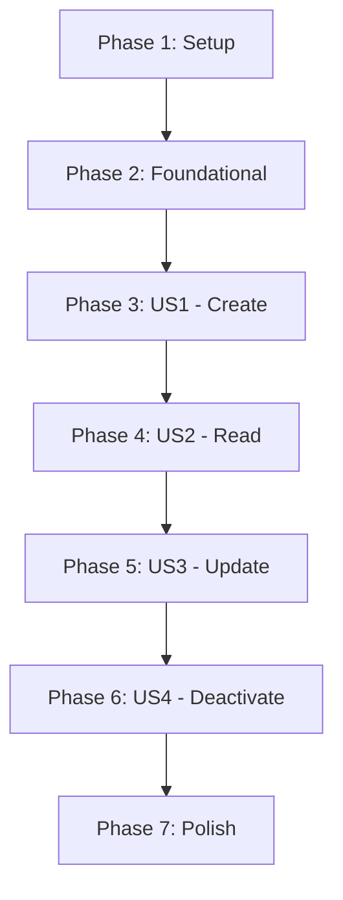

# Tasks: API Event CRUD Flow

**Input**: Design documents from `/specs/001-event-crud-api/`
**Prerequisites**: plan.md (required), spec.md (required), research.md, data-model.md, quickstart.md

**Organization**: Tasks are grouped by user story to enable independent implementation and testing. Comply with **Constitution Section 3** regarding mandatory JSON Schema validation.

## Format: `[ID] [P?] [Story?] Description`

- **[P]**: Can run in parallel (different files, no dependencies)
- **[Story]**: Which user story this task belongs to (e.g., US1, US2, US3)
- Include exact file paths in descriptions

---

## Phase 1: Setup (Shared Infrastructure)

**Purpose**: Project initialization and basic structure for Serenity Screenplay.

- [X] T001 Configure Serenity BDD, Screenplay Rest, and `serenity-rest-json-schema-validator` dependencies in `build.gradle`
- [X] T002 Configure base URL `http://localhost:50001` in `src/test/resources/serenity.conf`
- [X] T003 [P] Create `EventRequest` POJO with Builder pattern in `src/main/java/com/sofka/automation/models/EventRequest.java`
- [X] T004 [P] Create `EventResponse` POJO for deserialization in `src/main/java/com/sofka/automation/models/EventResponse.java`
- [X] T005 [P] Create `Endpoints` utility class in `src/main/java/com/sofka/automation/utils/Endpoints.java`
- [X] T006 [P] Store Event JSON Schemas in `src/test/resources/schemas/event-response-schema.json`

---

## Phase 2: Foundational (Blocking Prerequisites)

**Purpose**: Core infrastructure for "The System" Actor and abilities.

- [X] T007 Implement Actor initialization hook (The System) with `CallAnApi` ability in `src/test/java/com/sofka/automation/stepdefinitions/Hooks.java`
- [X] T008 Implement utility for Serenity Session management to store `eventId` in `src/main/java/com/sofka/automation/utils/SessionManager.java`

**Checkpoint**: Foundation ready - Actor can now perform REST interactions.

---

## Phase 3: User Story 1 - Create Event (Priority: P1) 🎯 MVP

**Goal**: Implement the "Creación exitosa de un evento básico" scenario from `hu05-admin-config.feature`.

**Independent Test**: Execute POST `/admin/events` and verify `201 Created` with valid ID and **JSON Schema** match.

### Implementation for User Story 1

- [X] T009 [US1] Create `PostEvent` Task in `src/main/java/com/sofka/automation/tasks/PostEvent.java`
- [X] T010 [US1] Create `TheEventSchema` Question for contract validation in `src/main/java/com/sofka/automation/questions/TheEventSchema.java`
- [X] T011 [US1] Create `TheEventResponseState` Question in `src/main/java/com/sofka/automation/questions/TheEventResponseState.java`
- [X] T012 [US1] Implement Step Definitions for "Creación exitosa de un evento básico" in `src/test/java/com/sofka/automation/stepdefinitions/EventStepDefinitions.java` (using `shared-specs` features)
- [X] T013 [US1] Add validation for 400 Bad Request flows (mandatory fields/past dates) per `spec.md`

**Checkpoint**: User Story 1 (POST) functional, with contract validation.

---

## Phase 4: User Story 2 - Read Event Information (Priority: P1) 🎯 MVP

**Goal**: Retrieve details of the event created in US1 and verify consistency.

**Independent Test**: Execute GET `/Events/{id}` and verify `200 OK`, **JSON Schema**, and matching data.

### Implementation for User Story 2

- [X] T014 [US2] Create `GetEvent` Task in `src/main/java/com/sofka/automation/tasks/GetEvent.java`
- [X] T015 [US2] Create `GetEventsList` Task in `src/main/java/com/sofka/automation/tasks/GetEventsList.java`
- [X] T016 [US2] Implement Questions to verify response body matches `EventResponse` fields and schema
- [X] T017 [US2] Implement Step Definitions for retrieval logic using session `eventId`

---

## Phase 5: User Story 3 - Update Event (Priority: P2)

**Goal**: Fix errors or adjust configurations of existing events according to `hu05`.

**Independent Test**: Execute PUT `/admin/events/{id}` and verify `200 OK` and updated fields.

### Implementation for User Story 3

- [X] T018 [US3] Create `PutEvent` Task in `src/main/java/com/sofka/automation/tasks/PutEvent.java`
- [X] T019 [US3] Implement Step Definitions for update logic and field verification
- [X] T020 [US3] Add validation for business rule: restricted fields when reservations exist

---

## Phase 6: User Story 4 - Remove Event (Soft Delete) (Priority: P2)

**Goal**: Deactivate events to make them invisible to users (Soft Delete).

**Independent Test**: Execute POST `/admin/events/{id}/deactivate` and verify `200 OK` and status `inactive`.

### Implementation for User Story 4

- [X] T021 [US4] Create `DeactivateEvent` Task in `src/main/java/com/sofka/automation/tasks/DeactivateEvent.java`
- [X] T022 [US4] Implement Step Definitions for deactivation and public list exclusion check
- [X] T023 [US4] Verify event is no longer returned in public `GET /Events` list

---

## Phase 7: Polish & Cross-Cutting Concerns

- [ ] T024 Implement global API failure logging in `src/main/java/com/sofka/automation/utils/LoggerUtils.java`
- [ ] T025 Refactor Tasks to ensure high cohesion (Clean Code standards)
- [ ] T026 Ensure sensitive environment variables are not hardcoded (using `serenity.conf`)

---

## Dependency Graph

## Implementation Strategy

1. **Contract First**: Implement **JSON Schema Validation** (T006, T010) immediately in Phase 3.
2. **SSOT Sync**: The Runner MUST point to `shared-specs/specs/001-ticketing-mvp/hu05-admin-config.feature`.
3. **Incremental Delivery**: Complete Phase 3 & 4 (POST/GET) before moving to Phase 5 & 6.
